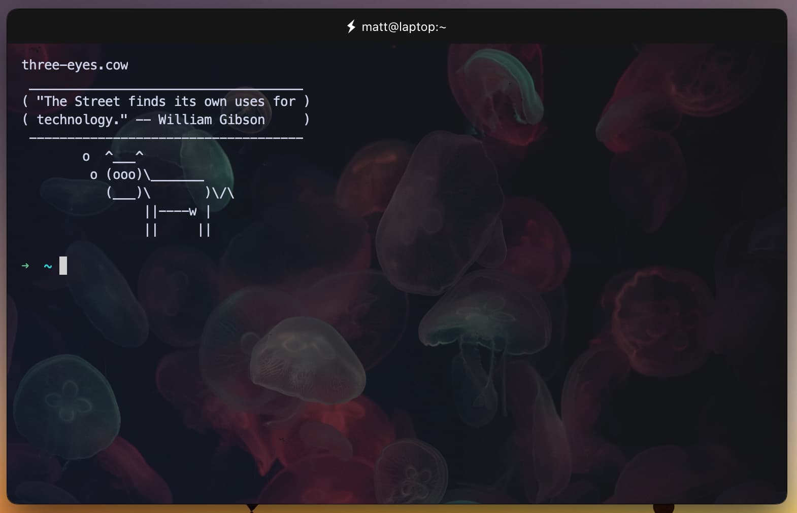

# hyper-wallpaper-packs


Extension for [Hyper](https://hyper.is/) terminal which introduces background image packs.



## Features
- **Prebuilt clean wallpaper packs**

## Installation
[//]: # (- Execute `$ hyper i hyper-wallpaper-packs` in your Hyper terminal)
[//]: # (or)
- Add `hyper-wallpaper-packs` to the list of plugins in `~/.hyper.js` manually


## Configuration
`hyper-wallpaper-packs` can be configured in `hyper.js` as follows:
```javascript
module.exports = {
  config: {
    
    // ...

      wallpaperPack: {
          name: "jellyfish"
      },
    
    // ...
    
  }
}
``` 

The available options in a wallpaper configuration are as follows:

| Option   | Type | Description                                                     |
|----------| --- |-----------------------------------------------------------------|
| name     | String | Wallpaper Pack to choose from. Current options are: `jellyfish`　 |


